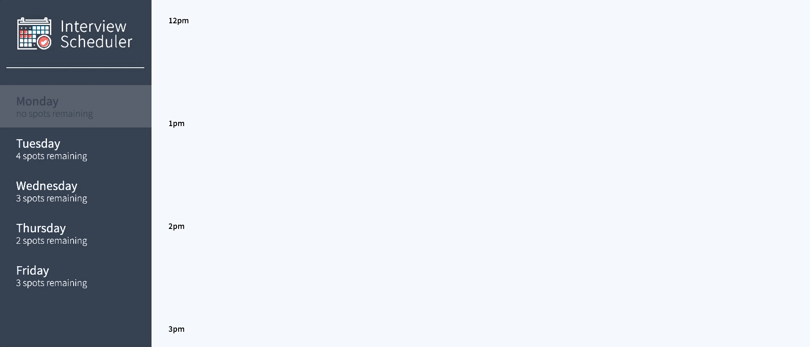

# Interview Scheduler
- This is a "Appoinment Booking" project built by Zongxi Li during the study in Lighthouse Labs Bootcamp. It is powered by React.JS and Express that provides the main functions you'd expect from a booking, such as making an appointment, removing an appointment and making changes to it, etc.

## Setup
Install dependencies with `npm install`.

## Technologies
- Storybook
- HTML
- SASS
- ReactJS
- Express.js
- PostgreSQL
- Javascript
- Jest
- Cypress

## Dependencies
- "axios": "^0.19.0",
- "classnames": "^2.2.6",
- "normalize.css": "^8.0.1",
- "react": "^16.9.0",
- "react-dom": "^16.9.0",
- "react-scripts": "3.0.0",
- "react-test-renderer": "^16.10.1"

## Running Webpack Development Server

```sh
npm start
```

## Running Jest Test Framework

```sh
npm test
```

## Running Storybook Visual Testbed

```sh
npm run storybook
```

## Main Features

- Create an Appointment: notice that the "Spots Remaining" on the left will be updated as well


- Update an Appointment


- Delete an Appointment (The other appointments are still there)
